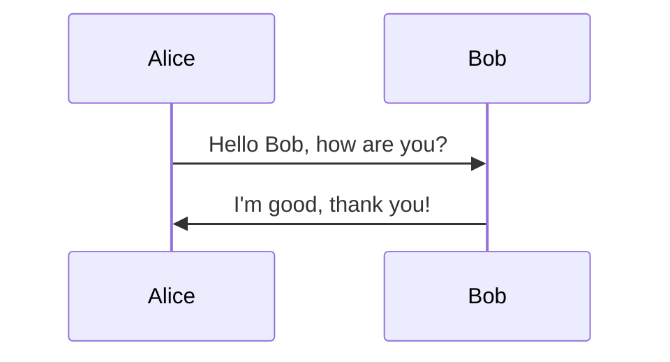
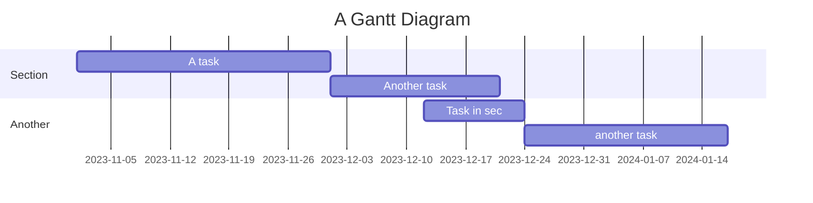
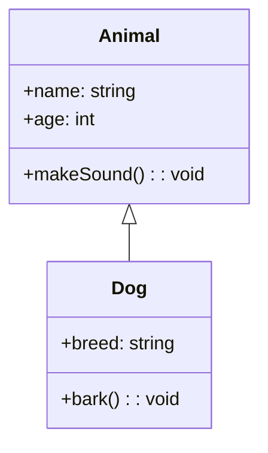

#Mermaid
##mermaid是用来做流程图的语言,用的markdown语言

####流程图
```markdown
graph TD;
    A-->B;
    A-->C;
    B-->D;
    C-->D;
```


####时序图
```markdown
sequenceDiagram
    participant A as Alice
    participant B as Bob
    A->>B: Hello Bob, how are you?
    B->>A: I'm good, thank you!
```


####甘特图
```markdown
gantt
    title A Gantt Diagram
    section Section
    A task           :a1, 2023-11-01, 30d
    Another task     :after a1  , 20d
    section Another
    Task in sec      :2023-12-12  , 12d
    another task    : 24d
```



####类图
```markdown
classDiagram
    class Animal {
        +name: string
        +age: int
        +makeSound(): void
    }
    class Dog {
        +breed: string
        +bark(): void
    }
    Animal <|-- Dog
```

